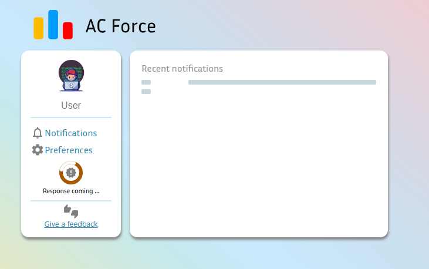
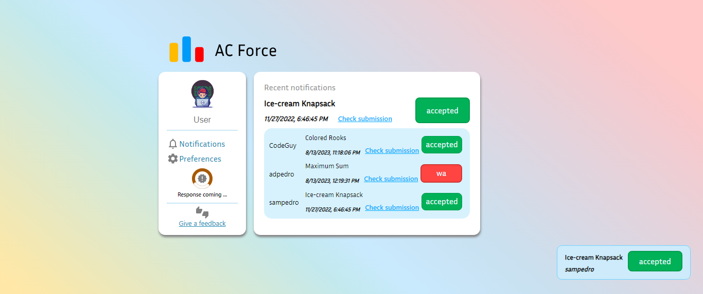
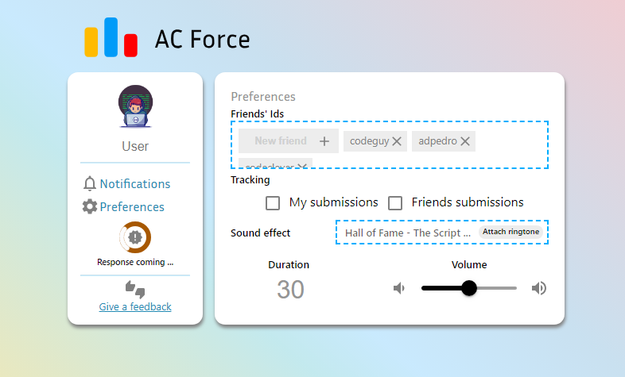
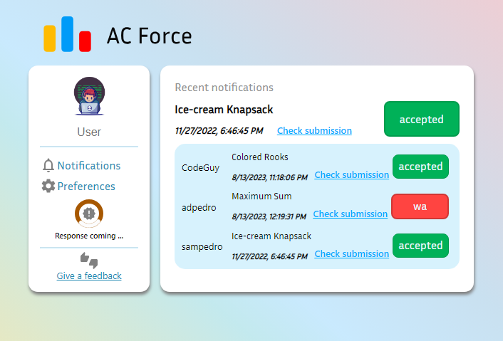

# AC Force Documentation

## Demo Prototype
Live demo: [AC Force](https://acforce.netlify.app)

<!--- --->

## Screenshots

## Features
Clear the storage by adding a new friend called `clear`.

## Installation and Usage

## Dependencies

## Credits

The AC Force implementation is created by `Alfredo Martins`.